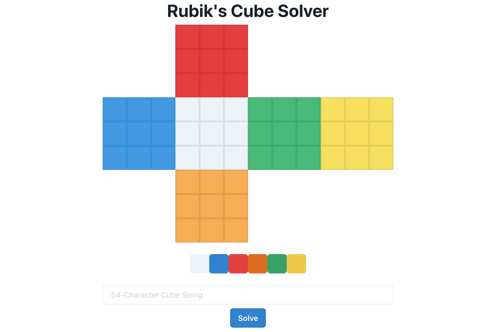

# rubik

A 3x3 Rubik's Cube solver written for my honors project in my Data Structures and Algorithms 
class.

## Overview

This project is primarily a web application, so it is divided into frontend and backend modules. 
The backend is written in Python and does most of the heavy lifting as my data structures 
class was taught in Python and the interface was originally a CLI. The frontend is a React app
written in TypeScript.


This project uses `poetry` to manage dependencies for the Python part and `npm` for the JavaScript
part, so you must have both installed. To download the python dependencies, you simply run 
`poetry install`. You can than forward any shell command to `poetry` using `poetry run`. 
For instance, to run an interactive session of python, use `poetry run python3`. `poetry` also
includes a shell to avoid the `poetry run` prefix to shell commands. You can launch this with 
`poetry shell`. To download the node dependencies, you similarly run `npm install`.

## Usage

To use this program, you have two interfaces: a CLI and a [website](https://rubik.arvind.me).

### CLI

The CLI simply accepts one optional argument, a 54-character string representation of the cube. 
It is made up of the 6 colors of a cube — **W**hite, **B**lue, **R**ed, **G**reen, **O**range, and 
**Y**ellow — and each character corresponds to a piece shown below.

<!-- TODO: Improve ASCII art of cube -->

```
           01 02 03
           04 05 06
           07 08 09

10 11 12   19 20 21   28 29 30   37 38 39
13 14 15   22 23 24   31 32 33   40 41 42
16 17 18   25 26 27   34 35 36   43 44 45

           46 47 48
           49 50 51
           52 53 54
```

If the 54-character cube string is not given, the program will automatically generate one from 
a randomly scrambled cube and solve that one for you. An example is shown below.

```
$ python3 rubik WRWGYBWRORYRYBGOWRBWYRRBYGRGOOYGWBOBGBGGORWWBGOYBWYYOO

    WRW
    GYB
    WRO
RYR BWY GOO GBG
YBG RRB YGW GOR
OWR YGR BOB WWB
    GOY
    BWY
    YOO

The solution requires 25 moves and took 2.03975 seconds.
F L F U B R B2 D R F U2 L2 U' L2 B2 U' F2 D L2 B2 D' R2 F2 U2 L2

    YYY
    YYY
    YYY
BBB RRR GGG OOO
BBB RRR GGG OOO
BBB RRR GGG OOO
    WWW
    WWW
    WWW
```

<!-- ```python
print()
``` -->

### Website



The website allows you to color a map of a Rubik's Cube in its unsolved state. Once you are done 
filling it in, you can press the Solve button and the website will show you the cube in its solved 
state, along with the moves to solve it.

The website is made up of a frontend written using React and a very simple backend written using 
FastAPI. The frontend makes an HTTP GET request when the solve button is pressed, passing a 
54-character string representation of the cube as a parameter. The backend returns a JSON 
containing the solved cube string, a list of moves, and the time it took to solve.

To use the website, click [here](https://rubik.arvind.dev). If you want to run it locally, 
run `npm start` in the `frontend` directory and run `poetry run python3 rubik/server.py` in the 
`backend` directory.
